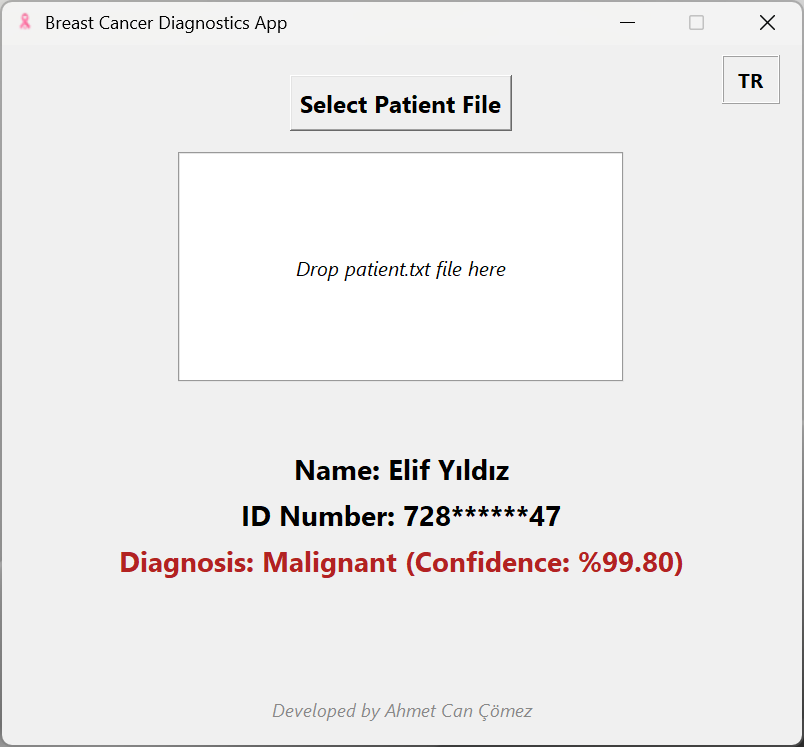
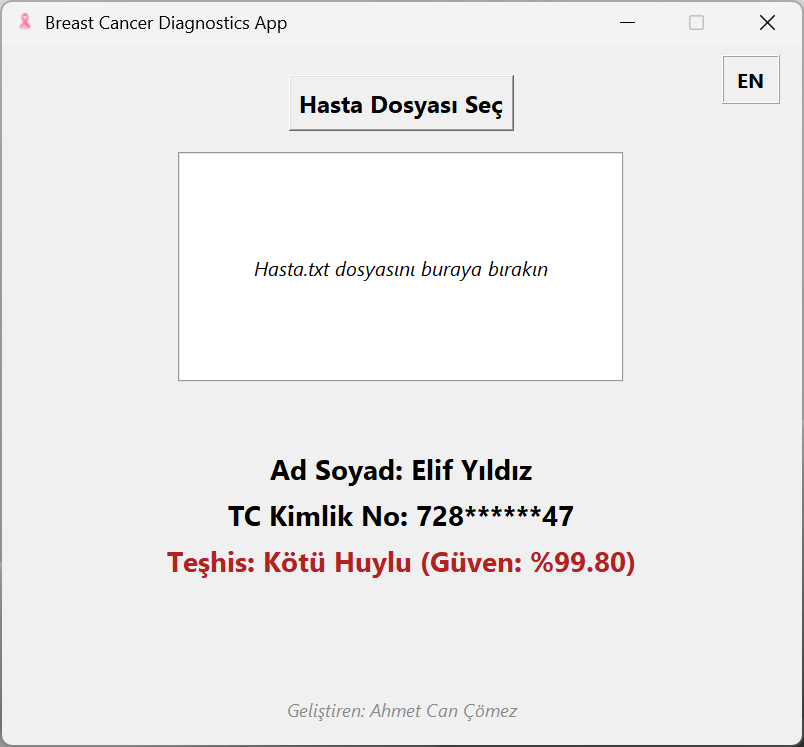
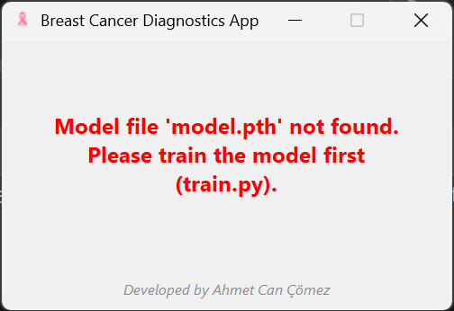

# Breast Cancer Diagnosis App

This is a bilingual desktop application (English and Turkish) built with Tkinter and PyTorch. It predicts whether a breast cancer case is malignant or benign using a trained neural network.
> ️**For detailed medical and technical documentation, modeling pipeline, and evaluation results, please check the [project wiki](https://github.com/cancmz/Breast-Cancer-Detector/wiki).**
## Features
- Drag-and-drop support for `.txt` patient files
- Multi-language support (EN/TR)
- Real-time prediction with confidence score
- Simple and user-friendly GUI
- Custom icon

##  Model
The model is trained on the publicly available Breast Cancer Wisconsin (Diagnostic) dataset using PyTorch.

##  Folder Structure
```
.
├── assets/
│   └── screenshots/
├── gui/
│   └── gui.py
├── model/
│   └── model.pth
├── sample data/
│   └── *.txt
├── train/
│   └── train.py
├── run.py
├── .gitignore
└── README.md
```

##  Sample Data
You can test the application using files in the `sample data/` folder.

##  How to Run
```
python run.py
```

##  Requirements
- Python 3.8+
- `torch`, `scikit-learn`, `tkinterdnd2`, `Pillow`

Install required packages:
```
pip install -r requirements.txt
```

##  Screenshots

#### Main Interface (English)


#### Ana Arayüz (Türkçe)

#### Error Interface (English)


##  Data Privacy Notice
This application uses the Breast Cancer Wisconsin (Diagnostic) dataset, which is publicly available and does not contain any personal or sensitive patient information.

All ID numbers and names used in the application or sample files are fictitious and randomly generated for demonstration purposes. They do not correspond to any real individual and are included only to simulate a realistic interface.

##  Author
Developed by Ahmet Can Çömez – 2025
